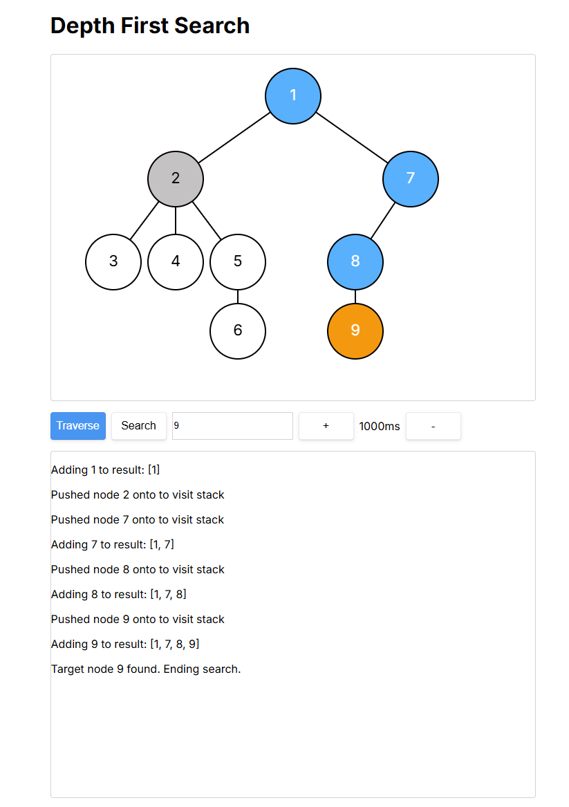
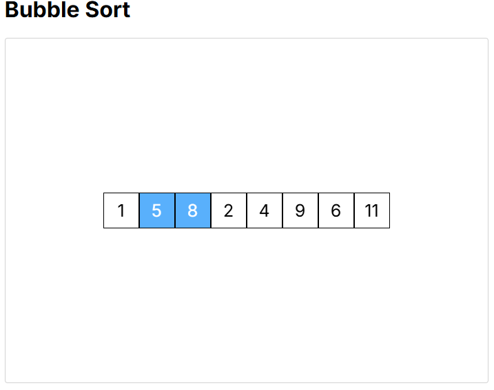
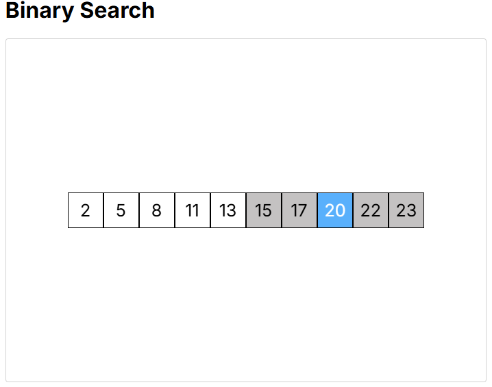

<a name="readme-top"></a>

<!-- Title and introduction -->
<div align="center">
<h3 align="center">Algorithms Visualiser</h3>
  <p align="center">
    Web application written in C# and TypeScript to visualise pathfinding, binary and sorting algorithms by 
    animating comparisons, swaps and traversal steps. This project was inspired by YouTube tutorials using visual guides to teach DSA. 
  </p>
</div>

<!-- Table of Contents -->
<details>
  <summary>Table of Contents</summary>
  <ol>
     <li>
      <a href="#algorithms-included">Algorithms Included</a>
    </li>
    <li>
      <a href="#screenshots">Screenshots</a>
    </li>
    <li>
      <a href="#getting-started">How to Run</a>
    </li>
  </ol>
</details>

<!-- Algorithms Included -->
<h2 id="algorithms-included">Algorithms Included</h2>

### Sorting Algorithms
- Bubble Sort
- Insertion Sort
- Selection Sort
- Merge Sort
- Quick Sort

### Pathfinding Algorithms
- Breadth-First Search (BFS)
- Depth-First Search (DFS)

### Searching Algorithms
- Binary Search
- Linear Search

<p align="right">(<a href="#readme-top">back to top</a>)</p>

<!-- Screenshots -->
<h2 id="screenshots">Screenshots</h2>

### Depth First Search 
<p align="middle">
  
</p> 

### Bubble Sort
<p align="middle">
  
</p> 

### Binary Search
<p align="middle">
  
</p> 

<p align="right">(<a href="#readme-top">back to top</a>)</p>

<!-- Getting Started -->
<h2 id="getting-started">Getting Started</h2>

#### 1. Clone the repository
```bash
git clone https://github.com/rquijote/algorithms-visualiser.git
cd algorithms-visualiser-main 
```

#### 2. Set up the backend (C#)
```bash
cd backend 
dotnet run
```

#### 3. Set up the frontend (React + Vite)
```bash
cd ../frontend
npm install 
npm run dev
```
<p align="right">(<a href="#readme-top">back to top</a>)</p>
